<!-- OPENSPEC:START -->
# OpenSpec Instructions

These instructions are for AI assistants working in this project.

Always open `@/openspec/AGENTS.md` when the request:
- Mentions planning or proposals (words like proposal, spec, change, plan)
- Introduces new capabilities, breaking changes, architecture shifts, or big performance/security work
- Sounds ambiguous and you need the authoritative spec before coding

Use `@/openspec/AGENTS.md` to learn:
- How to create and apply change proposals
- Spec format and conventions
- Project structure and guidelines

Keep this managed block so 'openspec update' can refresh the instructions.

<!-- OPENSPEC:END -->

# JavSP - Jav Scraper Package

## 变更记录 (Changelog)

| 时间 | 变更内容 |
|-----|---------|
| 2026-02-04T14:40:05 | 初始化架构文档：完整扫描项目结构，生成模块索引、架构图、开发指南 |

---

## 项目愿景

JavSP 是一个汇总多站点数据的 AV 元数据刮削器。它能够自动识别影片文件名中的番号信息，并行抓取多个站点的数据进行汇总，按照指定规则分类整理影片文件，并创建供 Emby、Jellyfin、Kodi 等媒体管理软件使用的 NFO 元数据文件。

**核心能力**:
- 自动识别影片番号（支持普通番号、FC2、CID、GETCHU、GYUTTO 等多种格式）
- 多线程并行抓取 19+ 个站点数据并智能汇总
- 下载高清封面，支持 AI 人脸识别裁剪海报（Slimeface）
- 生成符合 Kodi/Emby/Jellyfin 规范的 NFO 文件
- 支持翻译标题和剧情简介（Google/Bing/Baidu/Claude/OpenAI）
- 支持 Docker 部署和跨平台运行（Windows/Linux/macOS）

---

## 架构总览

```
JavSP/
|-- javsp/                   # 核心业务逻辑 (39 Python 文件)
|   |-- __main__.py          # 程序入口，主工作流
|   |-- avid.py              # 番号识别与分类
|   |-- config.py            # 配置管理（基于 Pydantic + ConfZ）
|   |-- datatype.py          # 核心数据类型：Movie, MovieInfo, GenreMap
|   |-- file.py              # 文件扫描与管理
|   |-- func.py              # 通用业务函数（更新检查、标题处理等）
|   |-- image.py             # 图片处理（验证、水印）
|   |-- lib.py               # 底层工具函数
|   |-- nfo.py               # NFO 文件生成
|   |-- chromium.py          # 浏览器 Cookies 提取
|   |-- print.py             # 输出重定向
|   |-- prompt.py            # 交互提示
|   |-- cropper/             # 封面裁剪模块
|   |   |-- __init__.py      # 裁剪器工厂
|   |   |-- interface.py     # Cropper 抽象接口
|   |   |-- slimeface_crop.py # Slimeface AI 裁剪实现
|   |   |-- utils.py         # 裁剪工具函数
|   |-- web/                 # 网站爬虫模块 (21 个爬虫)
|       |-- base.py          # HTTP 请求基础设施
|       |-- exceptions.py    # 爬虫异常定义
|       |-- translate.py     # 翻译服务
|       |-- proxyfree.py     # 免代理地址管理
|       |-- [site].py        # 各站点爬虫实现
|-- unittest/                # 单元测试 (7 测试文件, 80+ 测试数据)
|-- data/                    # 静态数据（genre 映射表、女优别名）
|-- tools/                   # 辅助工具脚本
|-- docker/                  # Docker 配置
|-- image/                   # 图片资源（图标、水印）
|-- config.yml               # 默认配置文件
```

---

## 模块结构图

```mermaid
graph TD
    A["JavSP 根目录"] --> B["javsp/"]
    A --> C["unittest/"]
    A --> D["data/"]
    A --> E["tools/"]
    A --> F["docker/"]

    B --> B1["__main__.py<br/>程序入口"]
    B --> B2["web/<br/>爬虫模块"]
    B --> B3["cropper/<br/>裁剪模块"]
    B --> B4["config.py<br/>配置管理"]
    B --> B5["datatype.py<br/>数据类型"]
    B --> B6["avid.py<br/>番号识别"]
    B --> B7["file.py<br/>文件扫描"]
    B --> B8["nfo.py<br/>NFO生成"]
    B --> B9["func.py<br/>业务函数"]
    B --> B10["image.py<br/>图片处理"]

    B2 --> W1["base.py<br/>HTTP基础"]
    B2 --> W2["exceptions.py<br/>异常定义"]
    B2 --> W3["translate.py<br/>翻译服务"]
    B2 --> W4["javbus.py"]
    B2 --> W5["javdb.py"]
    B2 --> W6["fanza.py"]
    B2 --> W7["...其他15个爬虫"]

    B3 --> CR1["interface.py<br/>抽象接口"]
    B3 --> CR2["slimeface_crop.py<br/>AI裁剪"]

    C --> T1["test_avid.py"]
    C --> T2["test_crawlers.py"]
    C --> T3["test_file.py"]
    C --> T4["conftest.py"]
    C --> T5["data/<br/>80+测试JSON"]

    D --> D1["genre_*.csv"]
    D --> D2["actress_alias.json"]

    click B3 "./javsp/cropper/CLAUDE.md" "查看 cropper 模块文档"
    click B2 "./javsp/web/CLAUDE.md" "查看 web 模块文档"
```



---

## 模块索引

| 模块路径 | 职责描述 |
|---------|---------|
| `javsp/__main__.py` | 程序入口，协调整个刮削工作流（扫描->抓取->汇总->生成） |
| `javsp/avid.py` | 从文件名提取番号，识别番号类型（normal/fc2/cid/getchu/gyutto） |
| `javsp/config.py` | 配置管理，支持 YAML 文件、环境变量、命令行参数三层优先级 |
| `javsp/datatype.py` | 定义 `Movie`、`MovieInfo`、`GenreMap` 核心数据类 |
| `javsp/file.py` | 扫描文件夹、识别分片影片、管理文件路径、字幕匹配 |
| `javsp/func.py` | 业务辅助函数（版本检查、标题处理、自动更新等） |
| `javsp/nfo.py` | 生成符合 Kodi 规范的 NFO XML 文件 |
| `javsp/image.py` | 图片验证、水印添加 |
| `javsp/lib.py` | 底层工具（路径处理、正则转义、时长转换、特殊属性检测） |
| `javsp/web/base.py` | HTTP 请求封装，支持代理、CloudFlare 绕过、文件下载 |
| `javsp/web/exceptions.py` | 爬虫异常类（MovieNotFoundError、SiteBlocked 等） |
| `javsp/web/translate.py` | 翻译服务（Google/Bing/Baidu/Claude/OpenAI） |
| `javsp/web/[site].py` | 各站点爬虫（airav, avsox, avwiki, fanza, fc2, javbus, javdb, javlib 等） |
| `javsp/cropper/` | 封面裁剪，支持默认裁剪和 Slimeface AI 裁剪 |

---

## 运行与开发

### 环境要求

- Python 3.10 - 3.12
- Poetry 或 uv（包管理工具）

### 安装依赖

```bash
# 使用 Poetry
poetry install

# 使用 uv
uv sync

# 安装 AI 裁剪功能（可选）
poetry install --extras ai-crop
# 或
uv sync --extra ai-crop

# 安装开发依赖
poetry install --with dev
```

### 运行程序

```bash
# 使用默认配置运行
poetry run javsp
# 或
uv run javsp

# 指定配置文件
poetry run javsp -c /path/to/config.yml

# 通过命令行参数覆盖配置
poetry run javsp -- --oscanner.input_directory '/path/to/movies'

# 通过环境变量覆盖配置
JAVSP_SCANNER.INPUT_DIRECTORY='/path/to/movies' poetry run javsp
```

### 构建可执行文件

```bash
# 使用 cx_Freeze 构建
poetry run python setup.py build
```

### Docker 运行

```bash
# 拉取镜像
docker pull ghcr.io/yuukiy/javsp:latest

# 运行
docker run -v /your/movies:/data ghcr.io/yuukiy/javsp
```

---

## 测试策略

### 测试框架

使用 `pytest` 进行单元测试。

### 测试分类

1. **基础功能测试** (`unittest/test_*.py`)
   - `test_avid.py`: 番号识别测试
   - `test_file.py`: 文件扫描测试
   - `test_func.py`: 通用函数测试
   - `test_lib.py`: 工具函数测试
   - `test_exe.py`: 可执行文件测试

2. **爬虫测试** (`unittest/test_crawlers.py`)
   - 基于 `unittest/data/` 目录下的 80+ JSON 文件进行数据对比
   - 支持 `--only` 参数指定测试特定爬虫
   - 自动处理 GitHub Actions 环境中的 CloudFlare 检测问题

3. **代理免翻墙测试** (`unittest/test_proxyfree.py`)

### 运行测试

```bash
# 运行所有测试
poetry run pytest

# 运行基础功能测试
poetry run pytest unittest/test_avid.py unittest/test_file.py unittest/test_func.py

# 运行爬虫测试
poetry run pytest unittest/test_crawlers.py

# 仅测试特定爬虫
poetry run pytest unittest/test_crawlers.py --only javbus

# 详细输出
poetry run pytest -rA --color=yes --tb=long --showlocals
```

### 添加爬虫测试数据

在 `unittest/data/` 目录下创建 JSON 文件，命名格式为 `{番号} ({爬虫名}).json`，例如：
- `IPX-177 (javbus).json`
- `FC2-1234567 (fc2).json`

---

## 编码规范

### 代码风格

- 使用 `flake8` 进行代码检查
- 运行：`poetry run flake8`

### 类型注解

- 项目使用 Python 类型注解，最低支持 Python 3.10
- 安装了 `types-lxml` 和 `types-pillow` 用于类型检查

### 爬虫开发规范

1. **模块结构**
   - 每个爬虫一个文件，放在 `javsp/web/` 目录
   - 必须实现 `parse_data(movie: MovieInfo)` 函数
   - 可选实现 `parse_clean_data(movie: MovieInfo)` 用于数据清洗和 genre 映射

2. **Genre 映射**
   - 使用 `GenreMap` 类加载 `data/genre_*.csv` 进行 genre 标准化
   - CSV 文件必须包含 `id` 和 `translate` 列，保存为 UTF-8-BOM 编码

3. **异常处理**
   - 使用 `javsp/web/exceptions.py` 中定义的异常类
   - `MovieNotFoundError`: 影片未找到
   - `MovieDuplicateError`: 影片重复
   - `SiteBlocked`: 站点被屏蔽/CloudFlare 拦截
   - `CredentialError`: 登录凭据无效
   - `SitePermissionError`: 权限不足
   - `WebsiteError`: 网站故障

4. **免代理地址**
   - 在 `config.yml` 的 `network.proxy_free` 中配置
   - 爬虫应根据是否配置代理选择使用原始地址或免代理地址

5. **HTTP 请求**
   - 使用 `Request` 类进行请求，支持自定义 headers、cookies
   - 使用 `cloudscraper` 绕过 CloudFlare 检测
   - 支持自动重试和超时配置

### 配置系统

配置基于 `ConfZ` + `Pydantic`，支持三层配置源（优先级从低到高）：
1. YAML 配置文件（`config.yml`）
2. 环境变量（前缀 `JAVSP_`）
3. 命令行参数（前缀 `-o`）

主要配置区块：
- `scanner`: 扫描选项（文件过滤、最小大小、忽略规则）
- `network`: 网络选项（代理、超时、重试、免代理地址）
- `crawler`: 爬虫选项（爬虫列表、必需字段、睡眠间隔）
- `summarizer`: 整理选项（路径模板、NFO 配置、封面裁剪）
- `translator`: 翻译选项（翻译引擎、翻译字段）
- `other`: 其他选项（交互模式、更新检查）

---

## AI 使用指引

### 理解主工作流

主入口在 `javsp/__main__.py` 的 `entry()` 函数：

1. 加载配置 (`Cfg()`)
2. 加载女优别名映射（如启用）
3. 检查更新（如启用）
4. 获取扫描目录 (`get_scan_dir()`)
5. 导入爬虫模块 (`import_crawlers()`)
6. 扫描影片文件 (`scan_movies()`)
7. 手动确认番号（如启用）
8. 进入普通整理模式 (`RunNormalMode()`)
   - 并行抓取各站点数据 (`parallel_crawler()`)
   - 汇总数据 (`info_summary()`)
   - 翻译信息（可选）
   - 生成文件名 (`generate_names()`)
   - 下载封面、裁剪海报 (`process_poster()`)
   - 写入 NFO (`write_nfo()`)
   - 移动文件 (`movie.rename_files()`)

### 关键数据流

```
文件路径
  -> avid.py (get_id/get_cid 提取番号)
  -> file.py (scan_movies 扫描并创建 Movie 对象)
  -> Movie 对象 (dvdid/cid, files, data_src)
  -> parallel_crawler (多线程并行抓取各站点)
  -> Dict[str, MovieInfo] (各站点的抓取结果)
  -> info_summary (按优先级汇总)
  -> 最终 MovieInfo (title, cover, actress, genre 等)
  -> generate_names (生成文件路径)
  -> nfo.py (生成 NFO XML)
  -> 移动/重命名文件
```

### 添加新爬虫

1. 在 `javsp/web/` 创建新文件（如 `newsite.py`）
2. 实现 `parse_data(movie: MovieInfo)` 函数，填充 MovieInfo 的各字段
3. 可选实现 `parse_clean_data(movie: MovieInfo)` 进行 genre 映射
4. 在 `javsp/config.py` 的 `CrawlerID` 枚举中添加新站点
5. 在 `config.yml` 的 `crawler.selection` 中添加新爬虫到对应类型
6. 创建 `data/genre_newsite.csv` 进行 genre 映射（如需要）
7. 添加测试数据到 `unittest/data/`

### 常见调试技巧

- 设置 `sys.javsp_debug_mode` 可在 `web/base.py` 中自动打开浏览器显示抓取的网页
- 单独运行爬虫模块进行测试：`python -m javsp.web.javbus`
- 使用 `MovieInfo.dump(crawler='sitename')` 保存抓取结果到测试数据目录
- 查看 `JavSP.log` 获取详细日志
- 查看 `FileMove.log` 获取文件移动记录

### 番号类型

| 类型 | 示例 | 数据源 |
|-----|------|-------|
| normal | ABC-123, IPX-177 | airav, avsox, javbus, javdb, javlib, jav321, mgstage, prestige |
| fc2 | FC2-1234567 | fc2, avsox, javdb, javmenu, fc2ppvdb |
| cid | sqte00300, h_123abc456 | fanza |
| getchu | GETCHU-4016932 | dl_getchu |
| gyutto | GYUTTO-242158 | gyutto |

---

## 支持的爬虫站点

| 爬虫 | 站点 | 番号类型 | 备注 |
|-----|------|---------|------|
| airav | AIRav | normal | 有预告片 |
| arzon | Arzon | normal | 需 Cookies |
| arzon_iv | Arzon IV | normal | IV 作品 |
| avsox | AVSOX | normal, fc2 | |
| avwiki | AVWiki | normal | |
| dl_getchu | DL.Getchu | getchu | 同人作品 |
| fanza | DMM/FANZA | cid | 主要数据源 |
| fc2 | FC2 官方 | fc2 | |
| fc2fan | FC2Fan | fc2 | 已关站，支持本地镜像 |
| fc2ppvdb | FC2PPVDB | fc2 | |
| gyutto | Gyutto | gyutto | 同人作品 |
| jav321 | JAV321 | normal | |
| javbus | JavBus | normal | 有女优头像 |
| javdb | JavDB | normal, fc2 | 有评分，封面有水印 |
| javlib | JavLibrary | normal | 有评分 |
| javmenu | JavMenu | fc2 | |
| mgstage | MGStage | normal | |
| njav | NJav | normal | |
| prestige | Prestige | normal | 蚊香社官网 |

---

## 相关文件清单

| 文件 | 说明 |
|-----|------|
| `pyproject.toml` | Poetry/uv 项目配置、依赖定义 |
| `setup.py` | cx_Freeze 打包配置 |
| `config.yml` | 默认配置文件模板 |
| `data/actress_alias.json` | 女优别名映射表 |
| `data/genre_*.csv` | 各站点 genre 翻译映射 |
| `.github/workflows/*.yml` | CI/CD 工作流配置 |
| `docker/Dockerfile` | Docker 镜像构建文件 |
| `CHANGELOG.md` | 版本变更记录 |

---

*文档生成时间: 2026-02-04T14:40:05*
